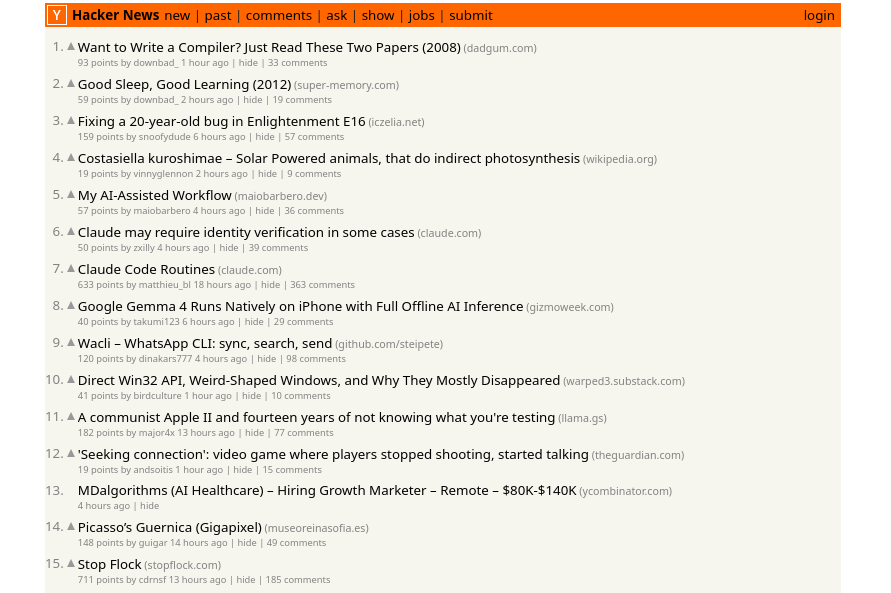
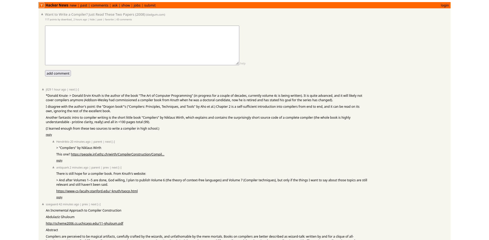

# hacker news clone

> [!IMPORTANT]
> [backlog - tuần 7](example.com)
> 
> [backlog - tuần 8](https://github.com/20252-IT4409-Nhom-20/BTL/milestone/1)
> 
> [tiêu chí chấm điểm](tieu_chi_cham_diem.md)

---

## 0. tổng quan

dự án nhái hackernews, và thêm tính năng cập nhật trực tiếp bài đăng mới và comment mới

---

## 1. front end

sử dụng framework vite - react: https://vite.dev/guide/

---

### 1.1. trang chủ

https://news.ycombinator.com/



Nhấn vào tiêu đề => mở link trong tab mới

Nhấn vào comment => xem phần bình luận

---

### 1.1.1. nav

thanh công cụ, link thẳng đến các trang phụ bằng `a href` đơn giản

=> chưa cần đổi

https://news.ycombinator.com/ask

```html
<table
  border="0"
  cellpadding="0"
  cellspacing="0"
  width="100%"
  style="padding: 2px"
>
  <tbody>
    <tr>
      <td style="width: 18px; padding-right: 4px">
        <a href="https://news.ycombinator.com"
          ></a>
      </td>
      <td style="line-height: 12pt; height: 10px">
        <span class="pagetop"
          ><b class="hnname"><a href="news">Hacker News</a></b
          ><a href="newest">new</a> | <a href="front">past</a> |
          <a href="newcomments">comments</a> | <a href="ask">ask</a> |
          <a href="show">show</a> | <a href="jobs">jobs</a> |
          <a href="submit" rel="nofollow">submit</a></span
        >
      </td>
      <td style="text-align: right; padding-right: 4px">
        <span class="pagetop"><a href="login?goto=news">login</a></span>
      </td>
    </tr>
  </tbody>
</table>
```

---

### 1.1.2 item

dữ liệu api trả về một mảng của các `id` của từng bài đăng:

https://hacker-news.firebaseio.com/v0/topstories.json?print=pretty

```json
[ 47776796, 47776557, 47774789, 47740840, 47775653, 47768133, 47774971, 47775628, 47724571, 47776667, 47776723, 47728662, 47775606, 47772012, 47739278, 47773812, 47725897, 47775183, 47767676
```

mỗi bài đăng có các thuộc tính sau, thuộc tính bắt buộc được in đậm

Field | Description
------|------------
**id** | The item's unique id.
deleted | `true` if the item is deleted.
type | The type of item. One of "job", "story", "comment", "poll", or "pollopt".
by | The username of the item's author.
time | Creation date of the item, in [Unix Time](http://en.wikipedia.org/wiki/Unix_time).
text | The comment, story or poll text. HTML.
dead | `true` if the item is dead.
parent | The comment's parent: either another comment or the relevant story.
poll | The pollopt's associated poll.
kids | The ids of the item's comments, in ranked display order.
url | The URL of the story.
score | The story's score, or the votes for a pollopt.
title | The title of the story, poll or job. HTML.
parts | A list of related pollopts, in display order.
descendants | In the case of stories or polls, the total comment count.

ví dụ: https://hacker-news.firebaseio.com/v0/item/8863.json?print=pretty

```javascript
{
  "by" : "dhouston",
  "descendants" : 71,
  "id" : 8863,
  "kids" : [ 8952, 9224, 8917, 8884, 8887, 8943, 8869, 8958, 9005, 9671, 8940, 9067, 8908, 9055, 8865, 8881, 8872, 8873, 8955, 10403, 8903, 8928, 9125, 8998, 8901, 8902, 8907, 8894, 8878, 8870, 8980, 8934, 8876 ],
  "score" : 111,
  "time" : 1175714200,
  "title" : "My YC app: Dropbox - Throw away your USB drive",
  "type" : "story",
  "url" : "http://www.getdropbox.com/u/2/screencast.html"
}
```

comment: https://hacker-news.firebaseio.com/v0/item/2921983.json?print=pretty

```javascript
{
  "by" : "norvig",
  "id" : 2921983,
  "kids" : [ 2922097, 2922429, 2924562, 2922709, 2922573, 2922140, 2922141 ],
  "parent" : 2921506,
  "text" : "Aw shucks, guys ... you make me blush with your compliments.<p>Tell you what, Ill make a deal: I'll keep writing if you keep reading. K?",
  "time" : 1314211127,
  "type" : "comment"
}
```

comment cũng có thể có comment (`kids`)

---

## 1.2. bài đăng



Tính sau :P